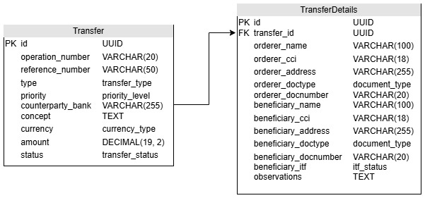

# Base de Datos del Servicio de Transferencias

En el entorno actual, los datos se han convertido en el núcleo vital de cualquier sistema. La perspectiva de datos en el diseño y desarrollo del del procesos de transferencias se enfoca en la generación, recolección, almacenamiento de los datos involucrados en una transferencias como la fecha de registro, la moneda utilizada, el monto transferido y el estado de la transferencia.

&nbsp;

Diagrama de Entidad Relación

&nbsp;

Diccionario de datos:

* Transfer

| Nombre de Columna   | Descripción                 | Tipos de Datos   |
|---------------------|-----------------------------|------------------|
| id                  | Clave primaria              | UUID             |
| operation_number    | Número de la operación      | VARCHAR(20)      |
| reference_number    | Número de referencia        | VARCHAR(50)      |
| type                | Tipo de transferencia       | transfer_type    |
| priority            | Prioridad                   | priority_level   |
| counterparty_bank   | Banco del beneficiario      | VARCHAR(255)     |
| concept             | Concepto de la transferencia| TEXT             |
| currency            | Moneda                      | currency_type    |
| amount              | Monto                       | DECIMAL(19, 2)   |
| status              | Estado de la transferencia  | transfer_status  |

&nbsp;

* TransferDetails

| Nombre de Columna     | Descripción                 | Tipos de Datos   |
|-----------------------|-----------------------------|------------------|
| id                    | Clave primaria              | UUID             |
| transfer_id           | ID de la transferencia      | UUID             |
| orderer_name          | Nombre del ordenante        | VARCHAR(100)     |
| orderer_cci           | Cuenta del ordenante        | VARCHAR(20)      |
| orderer_address       | Dirección del ordenante     | VARCHAR(255)     |
| orderer_doctype       | Tipo de documento           | document_type    |
| orderer_docnumber     | Número de documento         | VARCHAR(20)      |
| beneficiary_name      | Nombre del beneficiario     | VARCHAR(100)     |
| beneficiary_cci       | Cuenta del beneficiario     | VARCHAR(20)      |
| beneficiary_address   | Dirección del beneficiario  | VARCHAR(255)     |
| beneficiary_doctype   | Tipo de documento           | document_type    |
| beneficiary_docnumber | Número de documento         | VARCHAR(20)      |
| beneficiary_itf       | Estado de ITF               | itf_status       |
| observations          | Observaciones               | TEXT             |