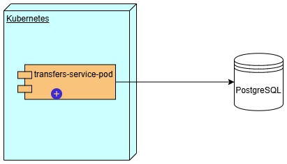

# Diagrama de Despliegue

En el contexto del proceso de transferencias que se propone para nuestro servicio, la perspectiva de despliegue aborda cómo se estructura, implementa y ejecuta la propuesta de desarrollo en el entorno operativo.

En lugar de ser meramente teórica, esta perspectiva se centra en los elementos prácticos y tecnológicos que hacen posible la funcionalidad del servicio.

&nbsp;

Componentes involucrados en el servicio de transferencias:

a)	Kubernetes.- Plataforma portable y extensible de código abierto para administrar cargas de trabajo y servicios. Ofrece un entorno de administración centrado en contenedores que facilita la automatización y la configuración declarativa

b)	Pod.- La unidad de computación desplegable más pequeña que se puede crear y gestionar dentro de un cluster de kubernetes.

c)	PostgreSQL.- Será el repositorio de datos donde se almacenará y administrará la información generada por ltransferencia.

