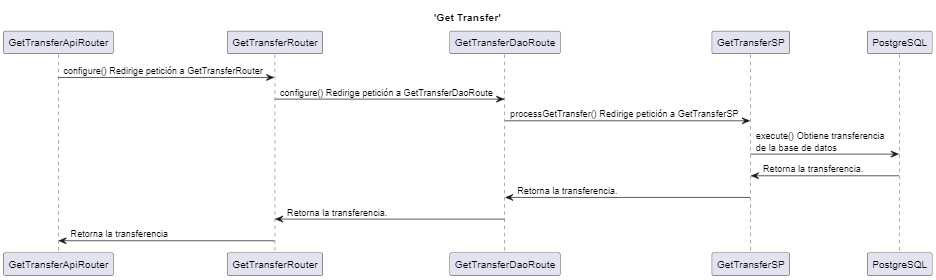
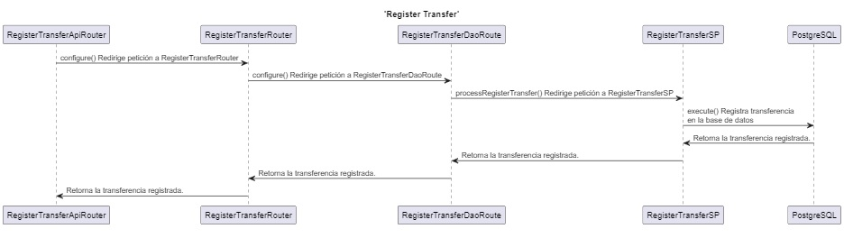
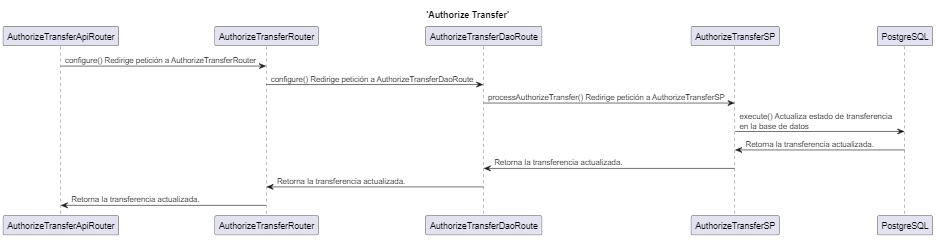
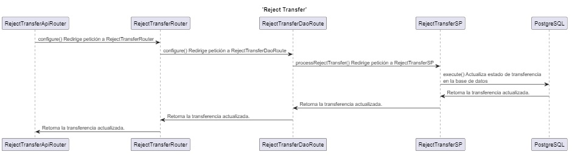

# Diagramas de secuencia

Para poder entender la lógica de los componentes implemenetados para el servicio de transferencias de Citibank, se han construido los diagramas de secuencia que brindan una visión clara de la comunicación entre los componentes del servicio, facilitando la identificación de oportunidades de mejora, optimización y corrección en la implementación.

* Citibank - API de Transferencias.

    - ‘Get Transfer’ muestra la secuencia e integración entre los componentes involucrados en el proceso de obtener una transferencia de la base de datos por su ID.

    

    &nbsp;

    - ‘Register Transfer’ muestra la secuencia e integración entre los componentes involucrados en el proceso que registra una transferencia en la base de datos.

    

    &nbsp;

    - ‘Authorize Transfer’ muestra la secuencia e integración entre los componentes involucrados en el proceso que realiza la autorización de una transferencia.

    

    &nbsp;

    - Reject Transfer’ muestra la secuencia e integración entre los componentes involucrados en el proceso que realiza el rechazo de una transferencia.

    